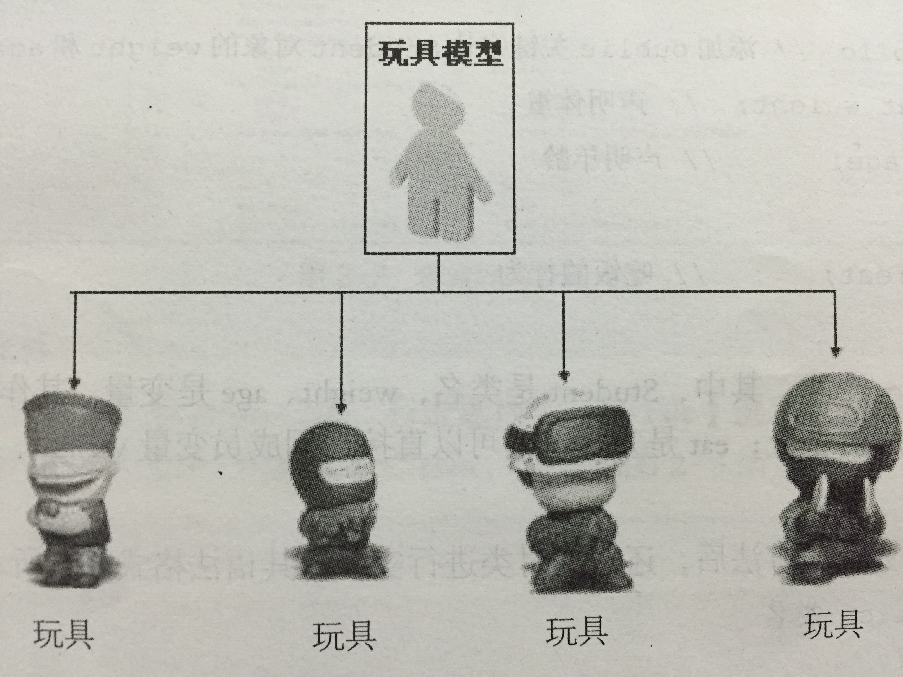
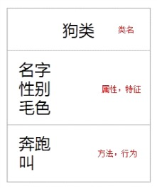

# 一.  函数

## 1.  局部变量

### 1)  什么是局部变量

> 函数内部定义的变量,是局部变量


```python
# 定义一个函数
def my_func1():
    # 定义一个局部变量
    # 定义在函数内部的变量 叫做局部变量
    # 局部变量的作用域(使用范围)在函数的内部 函数的外部无法使用
    num = 10
    print(num)

# 调用函数
my_func1()


# 再定义一个函数
def my_func2():
    # 定义一个局部变量
    num = 10
    print(num)

# 在函数内部定义的局部变量名可以和其他函数中的局部变量名相同 是不冲突的
my_func2()
```

### 2)   总结

- 局部变量，就是在函数内部定义的变量
- 其作用范围是这个函数内部，即只能在这个函数中使用，在函数的外部是不能使用的
- 因为其作用范围只是在自己的函数内部，所以不同的函数可以定义相同名字的局部变量（打个比方，把你、我是当做成函数，把局部变量理解为每个人手里的手机，你可有个iPhone8，我当然也可以有个iPhone8了， 互不相关）
- 局部变量的作用，为了临时保存数据需要在函数中定义变量来进行存储
- 当函数调用时，局部变量被创建，当函数调用完成后这个变量就不能够使用了


## 2. 全局变量

### 1)  什么是全局变量

> 如果一个变量，既能在一个函数中使用，也能在其他的函数中使用，这样的变量就是全局变量
>
> 打个比方：有2个兄弟 各自都有手机，各自有自己的小秘密在手机里，不让另外一方使用（可以理解为局部变量）；但是家里的电话是2个兄弟都可以随便使用的（可以理解为全局变量）

demo如下:

```python
# 定义全局变量
a = 100

def test1():
    print(a)  # 虽然没有定义变量a但是依然可以获取其数据

def test2():
    print(a)  # 虽然没有定义变量a但是依然可以获取其数据

# 调用函数
test1()
test2()
```

运行结果:

```
100
100
```

### 总结1:

- 在函数外边定义的变量叫做`全局变量`
- 全局变量能够在所有的函数中进行访问


### 2)  相同名字的全局和局部变量

看如下代码:

```python
# 定义一个全局变量 
a = 100
def func1():
    a = 300
    print('------func1----修改前---a = %d ' %  a)
    a = 200
    print('------func1----修改后---a = %d ' %  a)
def func2():
    print('------func2-----a = %d ' % a)
    
 # 调用函数
func1()
func2()
```

结果: 

```
------func1----修改前---a = 300 
------func1----修改后---a = 200 
------func2-----a = 100 
```


### 总结2:

- 当函数内出现局部变量和全局变量相同名字时，函数内部中的 `变量名 = 数据` 此时理解为定义了一个局部变量，而不是修改全局变量的值


### 3) 修改全局变量

>  函数中使用全局变量时可否进行修改呢？

代码如下:

```python
# 定义一个全局变量 
a = 100
def func1():
    global a
    print('------func1----修改前---a = %d ' %  a)
    a = 200
    print('------func1----修改后---a = %d ' %  a)
def func2():
    print('------func2-----a = %d ' % a)
    
 # 调用函数
func1()
func2()
```

结果:

```
------func1----修改前---a = 100 
------func1----修改后---a = 200 
------func2-----a = 200 
```

### 总结3:

- 如果在函数中出现`global 全局变量的名字` 那么这个函数中即使出现和全局变量名相同的`变量名 = 数据` 也理解为对全局变量进行修改，而不是定义局部变量
- 如果在一个函数中需要对多个全局变量进行修改，那么可以使用

```
# 可以使用一次global对多个全局变量进行声明
global a, b
     
# 还可以用多次global声明都是可以的
global a
global b
```


## 3. 函数参数(二)

### 1)  位置参数

> 位置参数是指我们调用函数时传入的函数值和定义函数时的参数是一一对应的.

demo:


```python

# 定义一个函数
def my_func1(a, b):
    print(a + b)


# 函数的调用 -> 位置参数调用函数
# 使用位置参数调用函数 需要注意实参的位置
# 实参的位置和形参的位置要一一对应
# TypeError: my_func1() missing 1 required positional argument: 'b'
# 如果实参传入的少一个实参 会报错
# my_func1(11)

```


### 2)  关键字参数

> 我们调用函数的时候可以指定要传递的参数名称, 直接把实参传递给对应的形参.

demo:

```python
# 通过指定形参名字的形式,把实参直接传递给对应的形参.
def func(a, b):
    result = a + b
    print(result)

# 可以这样调用关键字参数
func(a = 10, b = 20)
# 或者这样: 
func(b = 20, a = 10)

```

结果:

```
30
30
```


```python
#定义一个函数
# python是一个弱类型
def my_print(name, age, no):
    print("我的名字:%s" % name)
    print("我的年龄:%d" % age)
    print("学号:%s" % no)

# 调用-> 位置参数
# my_print("小明", 20)

# 关键字参数
# 调用函数的时候使用的是函数的形参名
# my_print(age=22, name="老王")
# my_print(name="老王", age=22)

# 调用函数的时候 使用了位置和关键字参数混合
# 如果混合使用 需要叫位置参数在前 关键字参数再后
# 如果某个参数使用了关键字参数 后面的都需要使用关键字参数
my_print("小明", age=20, no="007")
```


### 3) 缺省参数

> 缺省参数就是指的默认值参数, 即如果我们调用函数的时候没有传入该参数, 那么就直接使用该缺省参数.

如果age没有被传入,下例会打印默认的age：

```python
def printinfo(name, age=35):
   # 打印任何传入的字符串
   print("name: %s" % name)
   print("age %d" % age)

# 调用printinfo函数
printinfo(name="miki")  # 在函数执行过程中 age去默认值35
printinfo(age=9 ,name="miki")
```

以上实例输出结果：

```
name: miki
age: 35
name: miki
age: 9
```

#### 总结：

- 在形参中默认有值的参数，称之为缺省参数
- 注意：带有默认值的参数一定要位于参数列表的最后面, 否则报错

```python
# 定义一个函数 名字 学号 年龄
def my_print(name, no, age):
    print("名字:%s" % name)
    print("学号:%s" % no)
    print("年龄:%d" % age)
    print("="*30)

# 小明 001 20
# 小红 002 20
# 小张 003 20
my_print("小明", "001", 20)
my_print("小红", "002", 20)
my_print("小张", "003", 20)


# 定义一个有缺省参数的函数
# 缺省参数: 给形参设置了一个默认值
# 定义一个函数 名字 学号 年龄
# def my_print(name, no, age=20):
#
#     print("名字:%s" % name)
#     print("学号:%s" % no)
#     print("年龄:%d" % age)
#     print("="*30)


# 小明 001 20
# 小红 002 20
# 小张 003 20
# 在调用函数的时候 如果有默认值 可以根据业务需求不传递
my_print("小明", "001")
my_print("小红", "002")
my_print("小张", "003")


# 假如这个my_print的函数打印全班的人的信息 有80% 是20岁 但是 20% 年龄在25-30之间
# 如果执行函数的时候提供实参 那么函数的形参使用实参
# 如果执行函数的时候没有提供实参 那么形参将使用默认值(缺省参数)
# my_print("老王", "010", 30)


# 在定义函数的时候某个形参使用了缺省参数 那么后面的形参 都需要用缺省参数
def my_print(name, age=20, no="001"):

    print("名字:%s" % name)
    print("学号:%s" % no)
    print("年龄:%d" % age)
    print("="*30)

```

###4)  函数返回多个数据的方式

```python
# 列表
def deal_name_age(name, age):
    # 处理后 姓名:小明  年龄:22
    new_name = "姓名:%s" % name
    new_age = "年龄:%d" % age
    return [new_name, new_age]

# 变量为列表
ret = deal_name_age("小明", 22)
print(ret[0])
print(ret[1])
```

运行结果:

```
姓名:小明
年龄:22
```


```python
# 字典
def deal_name_age(name, age):
    # 处理后 姓名:小明  年龄:22
    new_name = "姓名:%s" % name
    new_age = "年龄:%d" % age
    return {"name":new_name, "age":new_age}

my_dict = deal_name_age("小明", 22)
print(my_dict["name"])
print(my_dict["age"])
```

运行结果:

```
姓名:小明
年龄:22
```


```python
# 元组
def deal_name_age(name, age):
    # 处理后 姓名:小明  年龄:22
    new_name = "姓名:%s" % name
    new_age = "年龄:%d" % age
    # 如果在函数内部 使用return 返回值1 返回值2,... 默认就是元组类型 不需要写小括号
    return new_name, new_age

my_tuple = deal_name_age("小明", 22)
print(type(my_tuple))
print(my_tuple[0])
print(my_tuple[1])
```

运行结果:

```
<class 'tuple'>
姓名:小明
年龄:22
```


## 4. 拆包

> 什么是拆包?

拆包:  对于函数中的多个返回数据, 去掉元组, 列表 或者字典 直接获取里面数据的过程.

###1) 对列表进行拆包

```python
my_list = [1, 3.14, "hello", True]
num, pi, my_str, my_bool = my_list
# 或者
num, pi, my_str, my_bool = [1, 3.14, "hello", True]
```


### 2) 对元组进行拆包

```python
my_tuple = (1, 3.14, "hello", True)
num, pi, my_str, my_bool = my_tuple
```


### 3) 对字典进行拆包

```python
my_dict = {"name":"老王", "age": 19}
ret1, ret2 = my_dict
# 得到的是key  字典是无序的
print(ret1, ret2)
```

结果:

```
name age
```


### 4)  用拆包的形式定义变量

```python
# 一次定义多个变量
num1 = 10
num2 = 20
num3 = 30
num4 = 3.14
# # 龟叔 称之为比较pythonic 自夸
# # 变量名和值是一一对应
num1, num2, num3, num4 = 10, 20, 30, 3.14
```


### 5)  函数返回元组时直接拆包

对元组拆包: 

```python
def get_my_info():
    high = 178
    weight = 100
    age = 18
    return high, weight, age

# 这一步叫做拆包: 
my_high, my_weight, my_age = get_my_info()
print(my_high)
print(my_weight)
print(my_age)
```

结果:

```
178
100
18
```

也可以对列表或者元组拆包: 

```python
def function1():
    return [1, 2, 3]
def function2():
    return {"key1": 1, "key2": 2, "key3": 3}

# 调用函数,获取里面的数据
num1, num2, num3 = function1()
print(num1, num2, num3)

# 调用函数,获取里面的数据
ret1, ret2, ret3 = function2()
print(ret1, ret2, ret3)
```

结果:

```
1 2 3
key1 key2 key3
```


#### 总结：

- 拆包时要注意，需要拆的数据的个数要与变量的个数相同，否则程序会异常
- 除了对元组拆包之外，还可以对列表、字典等拆包
- 对字典拆包后获取的是字典的key值, 而不是value值


## 5. 面试题:  交换两个变量的值

>  面试的时候,经常看到这样的题型:  a = 1,  b = 2.      怎样把 a,  b 的值交换?

### 1)  方法一: 

> 定义一个变量c

```python
a = 1
b = 2
c = 0

c = a
a = b
b = c
```


### 2) 方法二:

> 加法运算:

```python
a = 1
b = 2

a = a + b  
b = a - b  
a = a - b  
```


### 3) 方法三:

> 异或运算

```python
a = 1
b = 2

a = a ^ b
b = a ^ b
a = a ^ b
```


### 4) 方法四:

> 拆包

```python
a = 1
b = 2

a, b = b, a
```


# 二. 匿名函数

## 1. 定义: 

> 用lambda关键词能创建小型匿名函数。这种函数省略了用def声明函数的标准步骤。
>
> lambda表达式，通常是在**需要一个函数，但是又不想费神去命名一个函数**的场合下使用，也就是指**匿名函数**。

```
lambda函数的语法只包含一个语句，如下：

	lambda [arg1 [,arg2,.....argn]]:expression

```

例如: 

```python
sum = lambda arg1, arg2: arg1 + arg2

# 调用sum函数
print("Value of total : %d" % sum( 10, 20 ))
print("Value of total : %d"% sum( 20, 20 ))
```

以上实例输出结果：

```
Value of total :  30
Value of total :  40
```


## 2. 应用场合

#### 1)  函数作为参数传递

例如:

```python
func1 = lambda x,y : x*x
ret = func1(10, 20)
# ret = 100


def func(a, b, func1):
    print('a:%d' % a)
    print('b:%d' % b)
    print('result:%d' % func1(a, b))

func(1, 2, lambda x, y : x + y)
```

结果:

```
a:1
b:2
result:3
```


####2)   作为内置函数的参数

```python
list = [
    {"name": "zhangsan", "age": 18}, 
    {"name": "lisi", "age": 19}, 
    {"name": "wangwu", "age": 17}
]
# key:可选参数, 如果指定了该参数会使用该参数的方法进行排序。
list.sort(key = lambda x: x['name'])
print(list)


list.sort(key= lambda x: x['age'])
print(list)
```

##### 按name排序:

```
[{'name': 'lisi', 'age': 19}, {'name': 'wangwu', 'age': 17}, {'name': 'zhangsan', 'age': 18}]
```

#####按 age 排序:

```
[{'name': 'wangwu', 'age': 17}, {'name': 'zhangsan', 'age': 18}, {'name': 'lisi', 'age': 19}]
```


```python
#add = lambda x, y : x+y
#add(1,2)  # 结果为3

def func(a,b):
     return lambda x:ax+b
f = func(1,1)
f = lambda x:ax+b
f(1) # 结果为2
```


## 总结: 

* lambda函数也叫匿名函数, 即  函数没有具体的名称.

* lambda  x, y : x + y 中:   lambda是关键字.   x, y 是函数的两个形参.    x + y是函数的返回值.

  * 上面的式子可以写成: 
  * def  func( x,  y ):    return x + y

* 匿名函数的可以作为参数, 传递到另一个函数中.

* ```python
  def first(x, y):
      return  x + y

  def second(x, y, opt):
      print(x)
      print(y)
      result = opt(x, y)
      print(result)

  second(22, 33, first)
  ```

* 上面的代码可以用匿名函数实现: 

* ```python
  def second(x, y, opt):
      print(x)
      print(y)
      result = opt(x, y)
      print(result)

  second(22, 33, lambda x, y: x + y)
  ```

* 通过上面的代码,你会发现代码变少了, 少了什么呢?   少了first函数的定义, 哪里去了呢?  简写到second函数调用的时候了.


# 四. 列表推导式

### 1)  简单了解:

> 所谓的列表推导式，就是指的轻量级循环创建列表

格式:

```
列表推导式的常见形式:

	my_list = [ item    for item in iterable]
	my_list: 列表名 (变量名,  属于标识符)
	item: 将要存放到列表中的内容
	for item in iterable:  非常标准的for循环表达式

	
	[expr for iter in iterable if cond_expr]
	expr: 将要存放到列表中的内容
	iter: 遍历的每一项内容
    iterable: 遍历的对象
    if cond_expr: 条件表达式, 只有满足当前条件的,才能存放到列表中.
```

例如:

```python
my_list = [x*x for x in range(10)]
print(my_list)


my_list1 = [x**2 for x in range(6)]
print(my_list1)
```

结果:

```
[0, 1, 4, 9, 16, 25, 36, 49, 64, 81]
[0, 1, 4, 9, 16, 25]
```


例如: 

```python
list = [x for x in range(3, 19, 2)]  # 如果对range()函数不了解的可以查看第二天的笔记
print(list)
```

结果:

```
[3, 5, 7, 9, 11, 13, 15, 17]
```


###2) 使用if的情况:

例如:

```python
list = [x for x in range(3, 10) if x % 2 == 0]
print(list)
```

结果:

```
[4, 6, 8]

```


例如: 

```python
list = [11, 10, 9, 8, 7, 6]

[x for x in list if x % 2]
```

结果:

```
[11, 9, 7]
```


例如: 

```python
llist = [x for x in 'hello python' if x != ' ' and x != 'l']
print(llist)
```

结果:

```
['h', 'e', 'o', 'p', 'y', 't', 'h', 'o', 'n']
```


# 五. 文件操作

> 什么是文件?      能够保存数据的集合.

> 常见的文件举例: 


## 1. 文件操作介绍

思考:  把大象转进冰箱需要几步?

如果想用word编写一份简历，应该有哪些流程呢？

> 1. 打开word软件，新建一个word文件
> 2. 写入个人简历信息
> 3. 保存文件
> 4. 关闭word软件

同样，在操作文件的整体过程与使用word编写一份简历的过程是很相似的

> 1. 打开文件，或者新建立一个文件
> 2. 读/写数据
> 3. 关闭文件


## 2.  文件的打开与关闭

### 1)  打开文件

在python，使用open函数，可以打开一个已经存在的文件，或者创建一个新文件.

说明:

* 使用open的时候,如果文件已经存在,则直接打开.
* 如果不存在,就创建一个新文件.

```
打开的方式:
	open(文件名，访问模式)
```

例如:

```python
 f = open('test.txt', 'w')
```

| 访问模式: |                                                              |
| --------- | ------------------------------------------------------------ |
| r         | 以只读方式打开文件。文件的指针将会放在文件的开头。这是默认模式。 |
| w         | 打开一个文件只用于写入。如果该文件已存在则将其覆盖。如果该文件不存在，创建新文件。 |
| a         | 打开一个文件用于追加。如果该文件已存在，文件指针将会放在文件的结尾。也就是说，新的内容将会被写入到已有内容之后。如果该文件不存在，创建新文件进行写入。 |
| rb        | 以二进制格式打开一个文件用于只读。文件指针将会放在文件的开头。这是默认模式。 |
| wb        | 以二进制格式打开一个文件只用于写入。如果该文件已存在则将其覆盖。如果该文件不存在，创建新文件。 |
| ab        | 以二进制格式打开一个文件用于追加。如果该文件已存在，文件指针将会放在文件的结尾。也就是说，新的内容将会被写入到已有内容之后。如果该文件不存在，创建新文件进行写入。 |
| r+        | 打开一个文件用于读写。文件指针将会放在文件的开头。           |
| w+        | 打开一个文件用于读写。如果该文件已存在则将其覆盖。如果该文件不存在，创建新文件。 |
| a+        | 打开一个文件用于读写。如果该文件已存在，文件指针将会放在文件的结尾。文件打开时会是追加模式。如果该文件不存在，创建新文件用于读写。 |
| rb+       | 以二进制格式打开一个文件用于读写。文件指针将会放在文件的开头。 |
| wb+       | 以二进制格式打开一个文件用于读写。如果该文件已存在则将其覆盖。如果该文件不存在，创建新文件。 |
| ab+       | 以二进制格式打开一个文件用于追加。如果该文件已存在，文件指针将会放在文件的结尾。如果该文件不存在，创建新文件用于读写。 |

### 2)  关闭文件

```
关闭格式:
	close()
```

例如:

```python
# 新建一个文件，文件名为:test.txt
f = open('test.txt', 'w')

# 关闭这个文件
f.close()
```


## 3. 文件的读写

### 1) 写数据    ------>   write

> 使用write()可以完成向文件写入数据

例如:

```python
f = open('test.txt', 'w', encoding='utf-8')
str = '''既然你诚心诚意的问了，
那我就大发慈悲的告诉你，
为了防止世界被破坏，
为了守护世界的和平，
贯彻爱与真实的邪恶，
可爱又迷人的反派角色，
白洞，白色的明天在等待着我们！
喵~就是这样 ~~~~~~
'''
f.write(str)
f.close()
```

我们会发现, 不但创建了一个新的文件,而且文件中还添加上了上面的语句.

**注意**:

- 如果文件不存在那么创建，如果存在那么就先清空，然后写入数据


### 2) 读数据  ---->  read

> 使用read(num)可以从文件中读取数据，num表示要从文件中读取的数据的长度（单位是字节）
>
> 如果没有传入num，那么就表示读取文件中所有的数据

例如:

```python
f = open('test.txt', 'r', encoding='utf-8')
content = f.read(5)  # 最多读取5个数据
print(content)

print("-"*30)  # 分割线，用来测试

content = f.read()  # 从上次读取的位置继续读取剩下的所有的数据
print(content)

f.close()  # 关闭文件，这个可以是个好习惯哦
```

结果:

```
竟然你诚心
------------------------------
诚意的发问了，
纳我就大发慈悲的告诉你，
为了防止世界被破坏，
为了守护世界的和平，
贯彻爱与真实的邪恶，
可爱又迷人的反派角色，
白洞，白色的明天在等待着我们！
喵~就是这样 ~~~~~~
```

注意：

- 如果用open打开文件时，如果使用的"r"，那么可以省略，即只写 `open('test.txt')`


### 3) 读数据 ------>  readlines

> 就像read没有参数时一样,  readlines可以按照行的方式把整个文件中的内容进行一次性读取，并且返回的是一个列表，其中每一行的数据为一个元素

例如:

```python
f = open('test.txt', 'r', encodint='utf-8')
content = f.readlines()
print(type(content))

i=1
for temp in content:
    print("%d:%s" % (i, temp))
    i += 1

f.close()
```

结果:

```
<class 'list'>
1:竟然你诚心诚意的发问了，

2:纳我就大发慈悲的告诉你，

3:为了防止世界被破坏，

4:为了守护世界的和平，

5:贯彻爱与真实的邪恶，

6:可爱又迷人的反派角色，

7:白洞，白色的明天在等待着我们！

8:喵~就是这样 ~~~~~~
```


### 4)  读数据 -----> readline

```python
f = open('test.txt', 'r', encoding='utf-8')

content = f.readline()
print("1:%s" % content)

content = f.readline()
print("2:%s" % content)

f.close()
```

结果:

```
1:竟然你诚心诚意的发问了，

2:纳我就大发慈悲的告诉你，
```


## 4. 应用: 制作文件的备份

给文件做备份的步骤:

1. 打开文件
2. 读取文件数据
3. 创建一个复制文件
4. 把读取的数据写入复制文件中
5. 关闭文件

代码: 

```python
# # 创建一个原文件
# # 打开文件
old_f = open("hm.txt", "w")
# # 写入数据
old_f.write("helloworld")
# # 关闭文件
old_f.close()


# 做备份文件 -> 伪代码
# 01 打开hm.txt文件
# 02 读取hm.txt文件的数据
# 03 创建一个hm[复件].txt文件
# 04 把从hm.txt读取的数据写入到hm[复件].txt文件中
# 05关闭文件

# 01 打开hm.txt文件
old_f = open("hm.txt", "r")
# 02 读取hm.txt文件的数据
result = old_f.read()

# 03 创建一个hm[复件].txt文件
new_f = open("hm[复件].txt", "w")
# 04 把从hm.txt读取的数据写入到hm[复件].txt文件中
new_f.write(result)

# 05关闭文件
old_f.close()
new_f.close()
```


## 5. 文件  文件夹的相关操作

>  有些时候，需要对文件进行重命名、删除等一些操作，python的os模块中都有这样的功能

### 1) 文件重命名

> os模块中的rename()可以完成对文件的重命名操作

```
格式:
import os
os.rename(需要修改的文件名, 新的文件名)
```

例如:

```python
import os
os.rename("毕业论文.txt", "毕业论文-最终版.txt")
```


### 2) 删除文件

> os模块中的remove()可以完成对文件的删除操作

```
格式:
import os
os.remove(待删除的文件名)
```

例如:

```python
import os
os.remove("毕业论文.txt")
```


### 3) 创建文件夹

> os模块中的mkdir()可以完成创建文件夹

```
import os
os.mkdir(文件夹名)
```

例如:

```
import os
os.mkdir("张三")
```


###4) 获取当前目录

> 获取文件所在的目录地址

```
import os
os.getcwd()
```

> 路径:   相对路径   绝对路径
>
> 相对路径:   相对于某一个文件的路径
>
> 绝对路径:   从根目录(磁盘)开始的目录!


### 5)  改变默认目录 

>  改变当前文件的默认路径

```
import os
os.chdir("../")
```


### 6)  获取目录列表

```
import os
os.listdir("./")
```


### 7)  删除文件夹

```
import os
os.rmdir(文件夹名)
```

例如:

```python
import os
os.rmdir("张三")
```


```python
import os
# 1. 文件重命名
# os模块中的rename()可以完成对文件的重命名操作
rename(需要修改的文件名, 新的文件名)
os.rename("hm.txt", "hmhm.txt")


# 2. 删除文件
# os模块中的remove()可以完成对文件的删除操作
remove(待删除的文件名)
os.remove("hm[复件].txt")


# 3. 创建文件夹
os.mkdir("黑马")


# 4. 获取当前目录
ret = os.getcwd()
# 获取的是绝对路径(可以看到盘符)
print(ret)

# 5. 改变默认目录
# ../ 上一级目录 ./ 或者../ 都是相对路径
os.chdir("../")
ret= os.getcwd()
print(ret)

# 6. 获取目录列表
# .idea python项目中个一个隐藏文件
# 文件名以.开头的就是一个隐藏文件
my_list = os.listdir()
print(my_list)

# 7. 删除文件夹
os.rmdir("黑马")
```


## 6. 应用: 批量修改文件名

```python
import os

# 准备工作
# 01 当前目录下创建一个文件夹
os.mkdir("黑马文件夹")

# 02 指定默认目录
os.chdir("黑马文件夹")
print(os.getcwd())

# 03 在黑马文件夹下面创建10个文件
for i in range(1, 11):
    # 打开文件
    f =open("hm%d.txt" % i, "w")
    # 关闭文件
    f.close()

# 实际工作
# hmx.txt -> hmx[中国].txt

# 01 指定默认目录
os.chdir("黑马文件夹")

# 02 获取当前目录下的目录列表
my_list = os.listdir()

# 03 遍历my_list
for file_name in my_list:
    # 得的新的文件名
    new_file_name = file_name.replace(".txt", "[中国].txt")
    # 对文件重命名
    os.rename(file_name, new_file_name)
```


# 六.面向对象基础

## 1. 面向对象编程介绍

**请用程序描述如下事情：**

- A同学报道登记信息
- B同学报道登记信息
- C同学报道登记信息
- A同学做自我介绍
- B同学做自我介绍
- C同学做自我介绍

```
stu_a = {
        "name":"A",
        "age":21,
        "gender":1,
        "hometown":"河北"
}
stu_b = {
        "name":"B",
        "age":22,
        "gender":0,
        "hometown":"山东"
}
stu_c = {
        "name":"C",
        "age":20,
        "gender":1,
        "hometown":"安徽"
}
def stu_intro(stu):
        """自我介绍"""
        for key, value in stu.items():
                print("key=%s, value=%d"%(key,value))

stu_intro(stu_a)
stu_intro(stu_b)
stu_intro(stu_c)
```

#### 考虑现实生活中，我们的思维方式是放在学生这个个人上，是学生做了自我介绍。而不是像我们刚刚写出的代码，先有了介绍的行为，再去看介绍了谁。

#### 用我们的现实思维方式该怎么用程序表达呢？

```
stu_a = Student(个人信息)
stu_b = Student(个人信息)
stu_c = Student(个人信息)
stu_a.intro()
stu_b.intro()
stu_c.intro()
```

- 面向过程：根据业务逻辑从上到下写代码
- 面向对象：将数据与函数绑定到一起，进行封装，这样能够更快速的开发程序，减少了重复代码的重写过程


面向过程编程最易被初学者接受，其往往用一长段代码来实现指定功能，开发过程的思路是将数据与函数按照执行的逻辑顺序组织在一起，数据与函数分开考虑。

今天我们来学习一种新的编程方式：面向对象编程（Object Oriented Programming，OOP，面向对象程序设计）


1）解决菜鸟买电脑的故事

第一种方式:

> 1)在网上查找资料
>
> 2)根据自己预算和需求定电脑的型号 MacBook 15 顶配 1W8
>
> 3)去市场找到苹果店各种店无法甄别真假 随便找了一家
>
> 4)找到业务员,业务员推荐了另外一款 配置更高价格便宜,也是苹果系统的 1W
>
> 5)砍价30分钟 付款9999
>
> 6)成交
>
> 回去之后发现各种问题

第二种方式 :

> 1)找一个靠谱的电脑高手
>
> 2)给钱交易


2）解决吃啤酒鸭的问题

第一种方式（面向过程）:

> 1)养鸭子
>
> 2)鸭子长成
>
> 3)杀
>
> 4)作料
>
> 5)烹饪
>
> 6)吃
>
> 7)卒

第二种方式（面向对象）:

> 1)找个卖啤酒鸭的人
>
> 2)给钱 交易
>
> 3)吃
>
> 4)胖6斤


需要了解的定义性文字:

面向对象(object-oriented ;简称: OO) 至今还没有统一的概念 我这里把它定义为: 按人们 认识客观世界的系统思维方式,采用基于对象(实体) 的概念建立模型,模拟客观世界分析、设 计、实现软件的办法。

面向对象编程(Object Oriented Programming-OOP) 是一种解决软件复用的设计和编程方法。 这种方法把软件系统中相近相似的操作逻辑和操作 应用数据、状态,以类的型式描述出来,以对象实例的形式在软件系统中复用,以达到提高软件开发效率的作用。


## 2. 类和对象

面向对象编程的2个非常重要的概念：类和对象

对象是面向对象编程的核心，在使用对象的过程中，为了将具有共同特征和行为的一组对象抽象定义，提出了另外一个新的概念——类

类就相当于制造飞机时的图纸，用它来进行创建的飞机就相当于对象


###1)   类

```
人以类聚 物以群分。
具有相似内部状态和运动规律的实体的集合(或统称为抽象)。 
具有相同属性和行为事物的统称
```

类是抽象的,在使用的时候通常会找到这个类的一个具体的存在,使用这个具体的存在。一个类可以找到多个对象


###2)  对象

```
某一个具体事物的存在 ,在现实世界中可以是看得见摸得着的。

可以是直接使用的
```


###3)   类和对象之间的关系



小总结：类就是创建对象的模板


###4) 练习：区分类和对象

```
奔驰汽车 类
奔驰smart 类 
张三的那辆奔驰smart 对象
狗 类
大黄狗 类 
李四家那只大黄狗 对象 
水果 类
苹果 类 
红苹果 类 红富士苹果 类 
我嘴里吃了一半的苹果 对象
```


###5) 类的构成

类(Class) 由3个部分构成

- 类的名称:类名
- 类的属性:一组数据
- 类的方法:允许对进行操作的方法 (行为)


####  举例：

1）人类设计,只关心3样东西:

- 事物名称(类名):人(Person)
- 属性:身高(height)、年龄(age)
- 方法(行为/功能):跑(run)、打架(fight)

2）狗类的设计

- 类名:狗(Dog)
- 属性:品种 、毛色、性别、名字、 腿儿的数量
- 方法(行为/功能):叫 、跑、咬人、吃、摇尾巴



### 6)  类的抽象

如何把日常生活中的事物抽象成程序中的类?

拥有相同(或者类似)属性和行为的对象都可以抽像出一个类

方法:一般名词都是类(名词提炼法)


#### 1   坦克发射3颗炮弹轰掉了2架飞机

- 坦克--》可以抽象成 类
- 炮弹--》可以抽象成类
- 飞机-》可以抽象成类


#### 2  小明在公车上牵着一条叼着热狗的狗

- 小明--》 人类
- 公车--》 交通工具类
- 热狗--》 食物类
- 狗--》 狗类


#### 3【想一想】如下图中，有哪些类呢？


说明：

- 人
- 枪
- 子弹
- 手榴弹
- 刀子
- 箱子


#### 4【想一想】如下图中，有哪些类呢？


说明:

- 向日葵
  - 类名: xrk
  - 属性:
  - 行为: 放阳光
- 豌豆
  - 类名: wd
  - 属性: 颜色 、发型,血量
  - 行为:发炮, 摇头
- 坚果:
  - 类名:jg
  - 属性:血量 类型
  - 行为:阻挡;
- 僵尸:
  - 类名:js
  - 属性:颜色、血量、 类型、速度
  - 行为:走 跑跳 吃 死


##  3*  定义类

```
定义一个类，格式如下：
class 类名:
    方法列表
```

demo：定义一个Hero类

```
# 经典类（旧式类）定义形式:
# class Hero:  
# class Hero():

# 新式类定义形式:
class Hero(object):  
    def info(self):
        print("英雄各有见，何必问出处。")
```

#### 说明：

- 定义类时有2种形式：新式类和经典类，上面代码中的Hero为新式类，前两行注释部分则为经典类；
- object 是Python 里所有类的最顶级父类；
- 类名 的命名规则按照"大驼峰命名法"；
- info 是一个实例方法，第一个参数一般是self，表示实例对象本身，当然了可以将self换为其它的名字，其作用是一个变量 这个变量指向了实例对象


## 4*   创建对象

python中，可以根据已经定义的类去创建出一个或多个对象。

创建对象的格式为:

```
对象名1 = 类名()
对象名2 = 类名()
对象名3 = 类名()
```

创建对象demo:

```python
class Hero(object):  # 新式类定义形式
    """info 是一个实例方法，类对象可以调用实例方法，实例方法的第一个参数一定是self"""
    def info(self):
        """当对象调用实例方法时，Python会自动将对象本身的引用做为参数，
            传递到实例方法的第一个参数self里"""
        print(self) 
        print("self各不同，对象是出处。")


# Hero这个类 实例化了一个对象  taidamier(泰达米尔)
taidamier = Hero()

# 对象调用实例方法info()，执行info()里的代码
# . 表示选择属性或者方法
taidamier.info()

print(taidamier)  # 打印对象，则默认打印对象在内存的地址，结果等同于info里的print(self)
print(id(taidamier))  # id(taidamier) 则是内存地址的十进制形式表示
```

#### 说明：

* 用类创建一个对象时，类似于用一个模子，来制造实物 


#### 问题：

> 对象既然有实例方法，是否也可以有自己的属性?


##5*  添加和获取对象的属性

类创建出来的对象,可以添加属性

例如:

人  ---->  类

小明 ----> 对象

那么创建的小明


例如:

```python
class Hero(object):
    """定义了一个英雄类，可以移动和攻击"""
    def move(self):
        """实例方法"""
        print("正在前往事发地点...")

    def attack(self):
        """实例方法"""
        print("发出了一招强力的普通攻击...")

# 实例化了一个英雄对象 泰达米尔
taidamier = Hero()

# 给对象添加属性，以及对应的属性值
taidamier.name = "泰达米尔"  # 姓名
taidamier.hp = 2600  # 生命值
taidamier.atk = 450  # 攻击力
taidamier.armor = 200  # 护甲值

# 通对.成员选择运算符，获取对象的属性值
print("英雄 %s 的生命值 :%d" % (taidamier.name, taidamier.hp))
print("英雄 %s 的攻击力 :%d" % (taidamier.name, taidamier.atk))
print("英雄 %s 的护甲值 :%d" % (taidamier.name, taidamier.armor))

# 通过.成员选择运算符，获取对象的实例方法
taidamier.move()
taidamier.attack()
```

#### 问题：

> 对象创建并添加属性后，能否在类的实例方法里获取这些属性呢？如果可以的话，应该通过什么方式？


## 6*  在方法内通过self获取对象属性

```python
class Hero(object):
    """定义了一个英雄类，可以移动和攻击"""
    def move(self):
        """实例方法"""
        print("正在前往事发地点...")

    def attack(self):
        """实例方法"""
        print("发出了一招强力的普通攻击...")

    def info(self):
        """在类的实例方法中，通过self获取该对象的属性"""
        print("英雄 %s 的生命值 :%d" % (self.name, self.hp))
        print("英雄 %s 的攻击力 :%d" % (self.name, self.atk))
        print("英雄 %s 的护甲值 :%d" % (self.name, self.armor))


# 实例化了一个英雄对象 泰达米尔
taidamier = Hero()

# 给对象添加属性，以及对应的属性值
taidamier.name = "泰达米尔"  # 姓名
taidamier.hp = 2600  # 生命值
taidamier.atk = 450  # 攻击力
taidamier.armor = 200  # 护甲值

# 通过.成员选择运算符，获取对象的实例方法
taidamier.info()  # 只需要调用实例方法info()，即可获取英雄的属性
taidamier.move()
taidamier.attack()
```

#### 问题：

> 创建对象后再去添加属性有点不合适，有没有简单的办法，可以在创建对象的时候，就已经拥有这些属性？


##7*  魔法方法 `__init__()`

```python
class Hero(object):
    """定义了一个英雄类，可以移动和攻击"""
    # Python 的类里提供的，两个下划线开始，两个下划线结束的方法，就是魔法方法，__init__()就是一个魔法方法，通常用来做属性初始化 或 赋值 操作。
    # 如果类面没有写__init__方法，Python会自动创建，但是不执行任何操作，
    # 如果为了能够在完成自己想要的功能，可以自己定义__init__方法，
    # 所以一个类里无论自己是否编写__init__方法 一定有__init__方法。

    def __init__(self):
        """ 方法，用来做变量初始化 或 赋值 操作，在类实例化对象的时候，会被自动调用"""
        self.name = "泰达米尔" # 姓名
        self.hp = 2600 # 生命值
        self.atk = 450  # 攻击力
        self.armor = 200  # 护甲值

    def move(self):
        """实例方法"""
        print("正在前往事发地点...")

    def attack(self):
        """实例方法"""
        print("发出了一招强力的普通攻击...")


# 实例化了一个英雄对象，并自动调用__init__()方法
taidamier = Hero()

# 通过.成员选择运算符，获取对象的实例方法
taidamier.info() # 只需要调用实例方法info()，即可获取英雄的属性
taidamier.move()
taidamier.attack()
```

#### 说明：

- `__init__()`方法，在创建一个对象时默认被调用，不需要手动调用
- `__init__(self)`中的self参数，不需要开发者传递，python解释器会自动把当前的对象引用传递过去。


**总结**:

* `__init__`方法也被成为构造方法
* 在python中,以`__`开头,以`__`结尾的方法,我们成为魔法方法
* 这个方法是由python提供给我们的,也可以理解为是由python中的object类,提供给我的.
* python可以通过这些魔法方法监听我们创建对象的进度
* 程序员也可以在自定义的类中,  重写该魔法方法,  在方法中做自己的事情.
* 注意. 当进入`__init__`这个模仿方法的时候, 对象已经创建成功了.


#### 问题：

> 在类的方法里定义属性的固定值，则每个对象实例变量的属性值都是相同的。
>
> 一个游戏里往往有很多不同的英雄，能否让实例化的每个对象，都有不同的属性值呢？


## 8*  有参数的`__init__()`方法

```python
class Hero(object):
    """定义了一个英雄类，可以移动和攻击"""

    def __init__(self, name, skill, hp, atk, armor):
        """ __init__() 方法，用来做变量初始化 或 赋值 操作"""
        # 英雄名
        self.name = name
        # 技能
        self.skill = skill
        # 生命值：
        self.hp = hp
        # 攻击力
        self.atk = atk
        # 护甲值
        self.armor = armor

    def move(self):
        """实例方法"""
        print("%s 正在前往事发地点..." % self.name)

    def attack(self):
        """实例方法"""
        print("发出了一招强力的%s..." % self.skill)

    def info(self):
        print("英雄 %s 的生命值 :%d" % (self.name, self.hp))
        print("英雄 %s 的攻击力 :%d" % (self.name, self.atk))
        print("英雄 %s 的护甲值 :%d" % (self.name, self.armor))


# 实例化英雄对象时，参数会传递到对象的__init__()方法里
taidamier = Hero("泰达米尔", "旋风斩", 2600, 450, 200)
gailun = Hero("盖伦", "大宝剑", 4200, 260, 400)


# print(gailun)
# print(taidamier)

# 不同对象的属性值的单独保存
print(id(taidamier.name)) 
print(id(gailun.name))

# 同一个类的不同对象，实例方法共享
print(id(taidamier.move())) 
print(id(gailun.move()))
```

#### 说明：

- 通过一个类，可以创建多个对象，就好比 通过一个模具创建多个实体一样
- `__init__(self)`中，默认有1个参数名字为self，如果在创建对象时传递了2个实参，那么`__init__(self)`中出了self作为第一个形参外还需要2个形参，例如`__init__(self,x,y)`

#### 注意：

1. 在类内部获取 属性 和 实例方法，通过self获取；
2. 在类外部获取 属性 和 实例方法，通过对象名获取。
3. 如果一个类有多个对象，每个对象的属性是各自保存的，都有各自独立的地址；
4. 但是实例方法是所有对象共享的，只占用一份内存空间。类会通过self来判断是哪个对象调用了实例方法。


## 9*  魔法方法: `__str__()`方法

```python
class Hero(object):
    """定义了一个英雄类，可以移动和攻击"""

    def __init__(self, name, skill, hp, atk, armor):
        """ __init__() 方法，用来做变量初始化 或 赋值 操作"""
        # 英雄名
        self.name = name  # 实例变量
        # 技能
        self.skill = skill
        # 生命值：
        self.hp = hp   # 实例变量
        # 攻击力
        self.atk = atk
        # 护甲值
        self.armor = armor

    def move(self):
        """实例方法"""
        print("%s 正在前往事发地点..." % self.name)

    def attack(self):
        """实例方法"""
        print("发出了一招强力的%s..." % self.skill)

    # def info(self):
    #     print("英雄 %s 的生命值 :%d" % (self.name, self.hp))
    #     print("英雄 %s 的攻击力 :%d" % (self.name, self.atk))
    #     print("英雄 %s 的护甲值 :%d" % (self.name, self.armor))


    def __str__(self):
        """
            这个方法是一个魔法方法 (Magic Method) ，用来显示信息
            该方法需要 return 一个数据，并且只有self一个参数，当在类的外部 print(对象) 则打印这个数据
        """
        return "英雄 <%s> 数据： 生命值 %d, 攻击力 %d, 护甲值 %d" % (self.name, self.hp, self.atk, self.armor)


taidamier = Hero("泰达米尔", "旋风斩", 2600, 450, 200)
gailun = Hero("盖伦", "大宝剑", 4200, 260, 400)

# 如果没有__str__ 则默认打印 对象在内存的地址。
# 当类的实例化对象 拥有 __str__ 方法后，那么打印对象则打印 __str__ 的返回值。
print(taidamier)
print(gailun)

# 查看类的文档说明，也就是类的注释
print(Hero.__doc__)
```

#### 说明：

- 在python中方法名如果是`__xxxx__()`的，那么就有特殊的功能，因此叫做“魔法”方法
- 当使用print输出对象的时候，默认打印对象的内存地址。如果类定义了`__str__(self)`方法，那么就会打印从在这个方法中 `return` 的数据
- `__str__`方法通常返回一个字符串，作为这个对象的描述信息


## 10*  魔法方法: `__del__()`方法(了解)

创建对象后，python解释器默认调用`__init__()`方法；

当删除对象时，python解释器也会默认调用一个方法，这个方法为`__del__()`方法

```python
class Hero(object):

    # 初始化方法
    # 创建完对象后会自动被调用
    def __init__(self, name):
        print('__init__方法被调用')
        self.name = name

    # 当对象被删除时，会自动被调用
    def __del__(self):
        print("__del__方法被调用")
        print("%s 被 GM 干掉了..." % self.name)


# 创建对象
taidamier = Hero("泰达米尔")

# 删除对象
print("%d 被删除1次" % id(taidamier))
del(taidamier)


print("--" * 10)


gailun = Hero("盖伦")
gailun1 = gailun
gailun2 = gailun

print("%d 被删除1次" % id(gailun))
del(gailun)

print("%d 被删除1次" % id(gailun1))
del(gailun1)

print("%d 被删除1次" % id(gailun2))
del(gailun2)
```

#### 总结

- 当有变量保存了一个对象的引用时，此对象的引用计数就会加1；
- 当使用del() 删除变量指向的对象时，则会减少对象的引用计数。如果对象的引用计数不为1，那么会让这个对象的引用计数减1，当对象的引用计数为0的时候，则对象才会被真正删除（内存被回收）。


