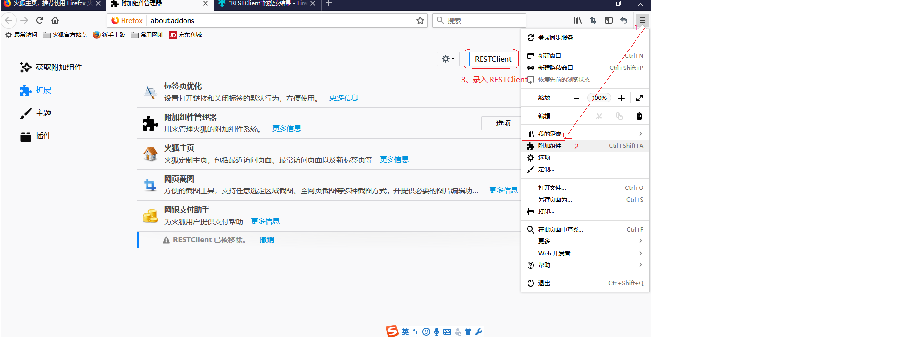
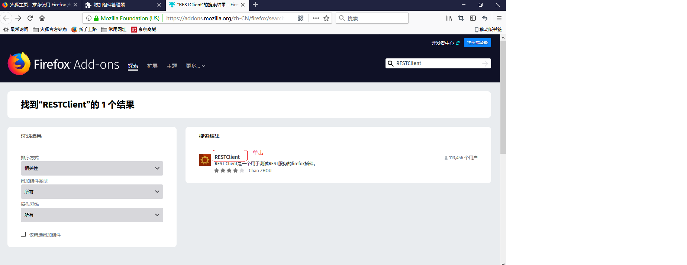
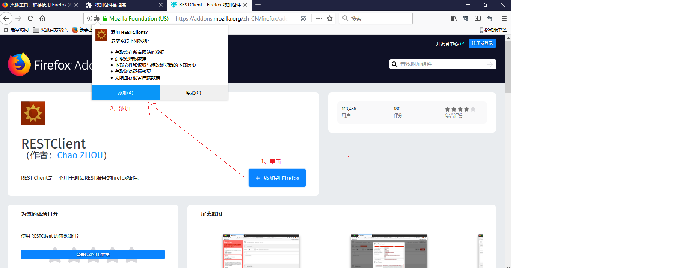

### 1、接口测试:接口（重点）

##### 	A、是什么?

数据交互的入口和出口，是一套规范一套标准

分类:

硬件 ----- USB 接口, 电源接口,网线接口.....

软件 ----- 就是前后端共同遵守的一套数据交互的规范(架构师制定接口)

##### 	B、为什么？

高效、灵活 _ 扩展性强 _提高内聚性降低了耦合性（记住）

 不使用接口的缺点：

```
1. 研发标准不统一，团队磨合难度高
2. 研发周期长
3. 可扩展性差
```

时优点：

```
1. 统一设计标准；
2. 前后端开发相对独立；
3. 扩展性灵活；
4. 前后端都可以使用自己熟悉的技术；
```

##### 	C、怎么用？

C-1、接口规范是架构师制定的

C-2、前端和后端开发时共同参考的依据

​	

### 2、接口测试:接口测试（重点）

##### 	A、是什么?

测试后端实现是否符合接口规范(不是测试接口本身)

##### 	B、为什么？

程序安全、效率

##### 	C、怎么用？(实现流程)

模拟客户向服务器发送数据，然后查看响应

要素1: 定位服务器资源(通过 URL 实现: http://www.baidu.com | http://127.0.0.1:8000/资源路径)

要素2: 模拟用户提交数据

要素3:查看响应的结果是否符合预期

**D、接口测试分类**(记住)

类型1:web接口测试 （BS 架构）

​	  | ----- 服务器接口测试:测试自己公司实现的接口

​	  | ----- 第三方接口测试:测试别的公司实现的接口

类型2:模块接口测试    (CS 架构)

​	

### 3、接口测试:环境搭建

##### 	A、是什么?

搭建接口测试的测试环境，运行程序

##### 	B、为什么？

必须的	

##### 	C、怎么用？

1)、运维或开发实现程序部署，正常运行

2) 、自己搭建

​	2-1、安装 python

​	2-2、安装依赖 :pip install -r requirements.txt -i https://pypi.douban.com/simple

​	2-3、启动项目 : python run_server.py

​	2-4、测试: http://127.0.0.1:8000/api/departments 如果正常响应数据了，那么程序安装并启动正常

3)、学生管理系统简介

​       核心: 学生表 班级表 学院表

​       操作: 3张表的增删改查

​	

### 4、接口测试:插件

##### 	A、是什么?

是测试接口的测试工具

火狐 ------ RESTClient

谷歌 ------ POSTman

Java  实现的测试工具: Jmeter(重点)

##### 	B、为什么？

测试工具功能强大一些，使测试更快捷方便

##### 	C、怎么用？

注意:二者安装时，都要注意版本

​	Google 插件资源下载被屏蔽了，安装提前下载完毕的,

​	<u>火狐安装 RESTClient</u>

​	






### 5、接口测试:RESTful 风格(重点)

##### 	A、是什么?

**RESTful 风格**： 开发测试时，大家都会遵守一些默认的规范，这些是约定成俗的，大家的习惯做法，非强制性的 RESTful 风格就是这些习惯中的一种s

RESTful 风格中规范了，URL 的实现方式，提交的数据的实现方式，响应的数据的实现方式 ......

##### 	B、为什么？

为了程序的易读性和易维护性	

##### 	C、怎么用?(记住)

RESTful 风格是约束接口操作的四种操作以及三个要素

**增:**

​	要素1:  URL +  POST

​	要素2: 多个数据

​		   方式1: 键=值&键=值

​		   方式2: JSON 格式

​	要素3: 200 | 201 +  添加的记录

**删:**

​	要素1: URL +  GET|DELETE

​	要素2:  方式1: 键=值&键=值

​	要素3: 200|204 + 无

**改:**

​	要素1:URL + POST|PUT(更合适)

​	要素2:

​		   方式1: 键=值&键=值

​		   方式2: JSON 格式s

​	要素3:200 | 201 + 修改后那条记录

**查:**

​	要素1: URL + GET

​	要素2:常用方式1 URL?键=值&键=值....

​	要素3:200 + 一条或多条记录


状态码:

404 ------ 资源路径有误

505 ------ 服务器异常


GET 和 POST 区别 ：

1、POST 安全性高

2、POST 提交的数据量没有大小限制

3、

​	

### 6、接口测试:JSON

##### 	A、是什么?

A-1、JSON 是一种数据载体

A-2、互联网本质就是数据传输，数据传输需要数据载体,比如：页面信息就是存储在 html 这种数据载体中的

A-3、HTML 格式:

​	 <html>

​		<head>

​		<title>hello</title>

​		</head>

​		<body>	

​			<font color='red'> hello world </font>

​		</body>

​	 </html>	

​	xml 格式:

​	<person>

​		<name>huluwa</name>

​		<age>8</age>

​	</person>

​	缺点:

​	标签标记语言，有效数据占有率低

  A-4、 JSON 优化数据传输

​	{"title":"hello","font":"hello world"}	

​	{"name":"huluwa","age":"8"}	

##### 	B、为什么？

JSON 传输数据效率更高，所以部分场景下使用 JSON 替换 html 和 XML_(ajax)

但是 JSON 语法描述性不及 标签语言，所以部分场景还得使用 html 和 xml

如果传递的是少量数据的话，可能使用 JSON

##### 	C、怎么用？

语法:

格式1(JSON对象):{"键1":"值1","键2":"值2".....}	

格式2(JSON数组):[值1,值2,值3.....]

格式复合: {"name":"huluwa","age":"8","aihao":["救爷爷",“吐火”,"吐水"]}

​		 [{"name":"huluwa","age":"8"},{"name":"aotuman","age":"10"}......]


### 7、接口测试:实战

​	目的:RESTful 风格练习

A、安装并运行学生管理系统

B、获取并读懂接口规范

​     B-1、从前期文档中提取接口清单 （了解此过程即可）

​     API 文档: application programing Interface 应用程序编程接口

​     B-2、接口清单读懂

​     要素1: URL + 请求方法

​     要素2: 提交的数据

​     要素3: 响应的结果


C、逐一测试接口


总结:

新增数据时，数据是 JSON 格式的，必须设置 浏览器的 http 请求头,不然会当成普通文本处理

​      Content-Type   applicaton/json;charset=utf-8 (记住)

​      Content-Type :  提交的内容类型 

​      application/json : 数据类型是 JSON 格式 | 大类型/小类型 img/jpg  img/png .....

​      charset=utf-8  :  设置编码集,utf-8 支持世界所有字符

