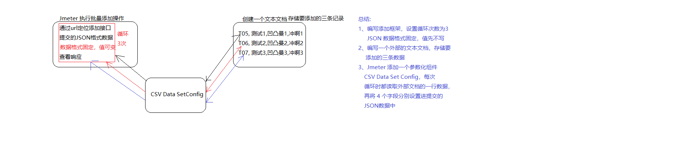
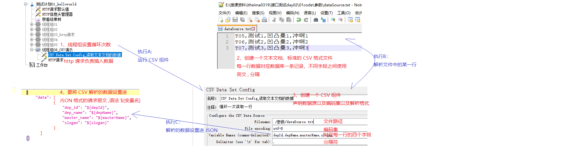

### 1、Jmeter: 概述

##### A、是什么?

Jmeter 是 Apache 公司使用 Java 开发的一款测试工具

##### B 、为什么?

高效、功能强大 

模拟一些高并发或多次循环等特殊测试场景 

##### C、怎么用?

C-1、下载 Jmeter，解压缩

C-2、安装 Java 环境(Jmeter 和 Java 环境的关系，类似于mp3 文件和 播放器关系)

​	 注意:安装路径不能有中文字符、空格

​		 安装了 JDK + JRE

C-3、简单了解 Jmeter 的目录结构

​	 bin ：  存储了 Jmeter 的可执行程序，比如启动程序

​	 lib   ：  存储了 Jmeter 整合的功能(一些 .jar 文件的小程序)

C-4、启动 Jmeter

​	启动方式1:bin/ApacheJmeter.jar 双击

​	启动方式2:jmeter.bat windows 下的启动程序

​			  jmeter.sh   linux 下的启动程序

C-5、编写一个 Jmeter 版本的测试案例

​	

##### D、Jmeter 的作用优点以及缺点(了解 )

作用：

```
1. 接口测试  
2. 性能测试  ：内在 ----- 程序的算法
3. 压力测试  ：外在 ----- 外在负载
4. Web自动化测试  
5. 数据库测试  : 测试数据库 
6. JAVA程序测试
```

优点：

```
1. 开源、免费 
2. 支持多协议 : http https ftp ftps .....
3. 小巧
4. 功能强大
```

缺点：

```
1. 不支持 IP 欺骗
2. 不支持前端测试
```

### 2、Jmeter组件:线程组(重点)

##### A、是什么?(记住)

---------------------------------------

进程: 一个正在执行的程序就对应一个进程

线程: 进程中的执行线索 （一个进程有多个执行线索）

线程组:按照线程性质对线程进行分组


并发执行: 多个线程同时执行 **特点: 执行结束的顺序和线程的启动顺序不一定一致**

顺序执行: 按照线程的启动顺序挨个执行

##### B 、为什么?

方便管理

##### C、怎么用?（基本使用）

C-1、三者关系： 进程有多个线程组，线程组可以有多个线程

​	 进程 ---- 测试计划

​	 线程组 ---- 线程组

​	 线程 ------- 线程组属性的线程数

C-2、默认情况下，线程组中的线程是并发执行的

​	  每一个线程都要执行组内的  http 请求	

C-3、怎么设置线程组顺序执行

​	 勾选测试计划的第一个复选框( 独立运行每个线程组)

C-4、线程组练习 学院增删 改查

##### D、练习：学生管理系统增删改查优化

可以使用 http 请求默认值抽取共同的 ip 端口号 协议 编码集 等信息 

测试计划 ---->  右击 -----> 添加  ----->配置元件 ------> http 请求默认值

作用: 通过复用属性简化实现，提高测试效率

##### E、线程组高级(初始化与销毁线程组)

E-1、线程组属性

属性1:线程数 ----- 模拟用户数

属性2:时间值 ----- 在指定时间内启动所有线程

属性3:循环数  ---- 单个用户访问的次数


E-2、调度器

1)、循环次数设置为 永远

2）、设置启动延迟 x和持续时间y

​	在 x 秒后访问服务器，并且持续  y 秒

3)、设置启动时间 M,和 结束时间 N

​	在 M 时开始访问，在  N 时结束

注意:2 和 3 实现不能同时使用，否则矛盾了


### 3、Jmeter组件:参数化概述(了解)

##### A、是什么?

参数化就是动态的获取并设置数据

##### B 、为什么?

比如执行批量操作时，批量插入或批量删除，之前数据都是手写的，每执行完都需要修改一次，效率太低

参数化就是可以以程序代替人工获取并设置数据: 安全 + 高效

### 4、Jmeter组件:参数化实现之CSV Data Set Config(重点中重点)

##### A、是什么?

Jmeter 参数化实现组件之一

##### B 、为什么?

通过这个组件可以动态获取并设置数据，实现类似批量添加操作(执行一次，将多条数据插入到数据库)

##### C、怎么用?

C-1、实现思想



C-2、实现流程



##### D、其他

CSV Data Set Config ----- CSV 数据配置 

CSV -----> 逗号分隔值文件格式


### 5、Jmeter 组件:线程组实现高级

Set Up 	    线程组 : 最先执行的线程组 

​				  加载程序主体执行所需的资源

Tear Down 线程组 : 最后执行的线程组

​				 程序正式关闭之前，可以将数据保存进内存

