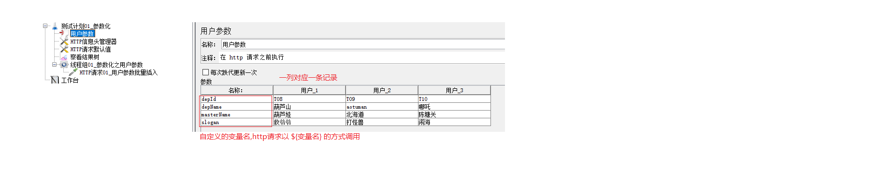
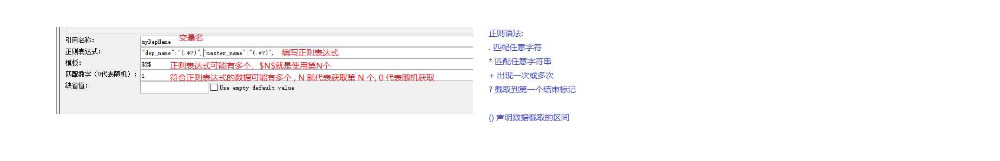

### 0、Jmeter组件:参数化

##### A、是什么?

参数化就是动态的获取并设置数据

##### B 、为什么?

参数化就是可以以程序代替人工获取并设置数据: 安全 + 高效

##### C、Jmeter参数化组件

CSV Data Set Config ----- CSV 数据设置组件

用户参数

用户定义的变量

函数

### 1、Jmeter组件:参数化之用户参数

##### A、需求(为什么)

向学生管理系统的学院表批量插入数据

##### B、实现(怎么用)

<u>B-1、实现思想(和 CSV 类似)</u>

将数据设置进第三方，然后循环读取数据,和 CSV 的区别:

CSV 是将数据设置进外部的文本文档，而用户参数是将数据设置进 Jmeter 内置组件

<u>B-2、实现流程</u>

1)、搭框架(测试计划，线程组，http请求_JSON 数据先不设置)

​       重点:执行次数是 3 次(<u>不是设置循环次数，而是设置线程数</u>)

2)、使用 Jmeter 内置组件存储要插入的数据

3)、读取组件中的数据设置进 Http 请求的 JSON

​       格式: ${变量名}

### 2、Jmeter组件:参数化之用户定义的变量

##### A、需求(为什么)

对学生管理系统执行增删改查相关操作时，资源路径不一定相同，单都是 /api/departments/ 开头,每次都编写此路径效率偏低,怎么优化？

##### B、实现(怎么用)

1)、将共同数据  /api/departments/ 使用一个组件存储

2)、编写路径时，直接调用组件存储的值s

注意: 一般存储全局使用的变量

### 3、Jmeter组件:参数化之函数

##### A、是什么?

函数是程序中最基本的封装单元，封装了一些常用功能，比如:计数器

##### A、需求(为什么)

循环10次查询学生管理系统的学院信息，结果树中，每次请求信息都是一样的，需要添加标号以示区分

##### B、实现(怎么用)

1)、打开Jmeter内置的函数组件

方式1: 选项 + 函数助手对话框

方式2: Ctrl + shift + F1 

方式3: 工具栏倒数第二个图标

2)、选择要使用的函数， 给函数传参，用Jmeter生成调用格式

__counter 函数的参数1: true 每个用户单独一个计数器， false 所有用户共用一个计数器 

3)、在需要调用函数的位置使用Jmeter生成的调用格式

调用格式： ${__函数名(参数)}

### 4、Jmeter组件:四种参数化方案比较

1、CSV 和用户参数使用思想一致，流程上后者更简单，但是实际应用，使用 CSV 居多，因为数据量大时，CSV 更方便

2、 用户定义的变量一般用来存储全局变量，但是使用场景较少

3、函数实现更为灵活且 内置了好多实现

4、总结: 最常用的是 CSV + 函数

--------------------------

### 5、Jmeter组件:直连数据库

##### A、是什么?

让 Jmeter 直接和数据库交互

##### B、为什么?

之前是通过接口操作数据库，可能出现的问题: 比如查询可能有漏查误查的情况，解决方案是人工比对，效率低且有安全隐患，解决方案：让程序代替人工

##### C、怎么用?

C-1、Jmeter 本身不具备直连数据库的功能,整合第三方实现

​	 不同的数据库对应不同的 jar 包实现 

C-2、配置数据库的一些连接信息

​	 variable name: 给当前连接组件命名,请求需要使用 

​	 database url   : 数据库路径

​	 Driver Class    : 第三程序的启动入口

​	 username: 账号 

​         password: 密码 

C-3、创建取样器(JDBC Request)连接数据库

​	   属性1 ：调用的配置的变量名 

​	   属性2 :  SQL 语句的类型 

​			 select Statement 查询

​			update Statement 修改(增 删 改)

​	   属性3：执行的 SQL 语句

C-4、结果再处理

​	就是要将 JDBC 操作的结果取出，并且传递给另外一个取样器

​	怎么实现:

​	1)、JDBC Request 中设置属性 variable names:  变量名

​	2)、JDBC Requst 操作数据库时，会将查询的结果赋值给步骤1设置的变量

​	       赋值规则:由于结果可能有多个，第 N 个结果赋值给  变量名_N

​				变量名_# 对应结果个数

​	       上述规则是固定格式: 记住

​	       怎么查询赋值规则: 添加取样器 Debug(调试) Sampler，可以查看底层实现细节

​	3)、其他取样器使用数据调研格式: ${变量名_N}

​	

### 6、Jmeter组件:关联(重点)

##### A、是什么?

就是一个请求的结果是另一个请求提交的数据，二者不再是独立存在的

##### B、为什么?

为了实现多样的业务逻辑(可能由多个请求组合而成)

##### C、怎么用?

实现方案1: Xpath 提取器

实现方案2: 正则表达式提取器

如果从标签(html | XML)语言提取数据最好使用  Xpath 提取器,如果想要的数据是文本格式,正则表达式提取器更方便

### 7、Jmeter环境

----------

##### A、什么是环境变量?path什么用?

系统设置之一,通过设置 PATH，可以让程序在 DOS 命令行直接启动

##### B、path怎么用?

如果想让一个程序可以在 DOS 直接启动，需要将该程序的目录配置进 PATH

##### C、PATH 和我们有什么关系?

要配置 JDK 的环境变量(开发必备的)  

------------

需求1:配置 JDK 的PATH环境变量，要求在任意目录下可以执行 javac 程序

需求2:配置Jmeter 的 PATH 环境变量 

需求3:配置 Jmeter 的 lib 目录下的部分 jar  的环境变量