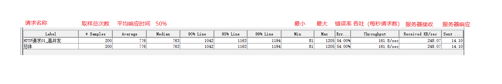

### 1、Jmeter组件:断言(重点)

##### A、是什么?

程序代替人工判断响应结果是否符合预期

##### B、为什么?

安全、高效、功能强大

##### C、怎么用?

分类：

C-1、断言响应的状态码

C-2、断言响应的内容

C-3、断言响应的内容的字节数

C-4、断言响应的时间

### 2、Jmeter组件:集合点

##### A、是什么?

Jmeter 内置组件之一，可以启动多个用户，让多个用户在同一刻去访问服务器

##### B、为什么?

可以模拟高并发实现，测试服务器性能

##### C、怎么用?

场景：模拟 N 个用户在同一时刻查询学院信息操作 

C-1、搭建框架(测试计划、结果树、线程组、http请求)

​	  线程组通过线程数模拟多个用户

C-2、添加集合点组件

​	 定时器  -----> 同步定时器 

​	 组件属性1: 一组用户数

​	 组件属性2: 超时时间  

C-3、运行查看结果

​	运行流程:

​	1)、启动线程 ----> 右上角

​	2)、所有线程启动完毕，再统一执行

​	查看结果添加聚合报告:

​	 

C-4、注意

超时时间可以设置为 0 : 无限等待

建议 ： 线程总数整除集合点的一组线程数，否则会挂起

### 3、Jmeter组件:函数

##### A、是什么? 

是程序中的封装单元(最小的)，封装一些功能实现

##### B、为什么?(了解)

优点1:易读 易维护 

优点2:实现功能复用

##### C、怎么用?

流程:

1)、打开Jmeter 内置的函数功能模块

2)、选择要调用的函数，传参数，生成调用格式

3)、哪里需要粘哪里

函数分类:

------

__counter() : 计数器

__random(): 随机数函数 

​		     包含左右临界值

__time() : 获取时间的函数

​		时间格式: yyyy/MM/dd HH:mm:ss == 年/月/日 时:分:秒

--------

__CSVRead() ：和 CSV Data Set Config 类似可以读取 CSV 文件数据

 需求:使用 CSVRead 函数实现学院信息的批量插入(比如: 3条)

思想:

1)、搭建框架(线程组设置循环次数),JSON 格式数据只是模板，具体数据动态获取

​       注意:执行次数设置与信息头设置

​	CSV Data Set Config 执行多次是使用的循环次数，而 CSVRead 执行多次使用的是线程数

2)、将数据存储在外部的文本文档(CSV 格式)

3)、使用 CSVRead 函数逐行获取并解析 CSV 文件，插入到提交的 JSON 数据中

​	CSVRead 函数设置 CSV文件路径时，必须得使用绝对路径，不可以使用相对路径

---------------------

__setProperty() : 属性设置

__property()	: 属性获取

 需求：http 请求1 访问百度，将请求1响应的 title 值传递给请求2，但是两个请求不属于同一个线程组

​	      http 请求2 访问 google  /?wd=百度一下你就知道

 实现思想 ：

​	  将线程组内部的数据导出去，存储在共享空间中，其他线程组要使用数据，就从共享空间获取

实现流程：

​	 1)、将数据从当前线程组导出 __setProperty

​		 变量名

​		 变量值  ${变量名}		

​		 <u>使用 BeanShell Sampler 调用函数</u>

​	 2)、另外一个线程组将导出到共享空间的数据引入 __property

​		根据变量名获取 

​	注意:

​		 查看共享数据，工作台 ----> 添加 -----> 非测试元件 ----> property display

​		

------

### 4、Jmeter:分布式

##### A、是什么?

多台测试机协作(集群方式)完成测试任务

##### B、为什么?

安全、高效、功能强大

##### C、怎么用?

C-1、基本架构:

C-2、环境搭建:

​	1) 、搭建伪分布式环境，一台设备模拟 3 台

​	2)、在同一台设备开启 3 个 Jmeter 即可

​	       复制 3 个 Jmeter，因为要同时启动然后网络间进行数据交互，修改端口号

​	3)、伪分布式下配置端口号

​		执行机 A，设置一个端口号: 6666

​		执行机 B，设置一个端口号: 7777

​		控制机要寻址执行机 ,配置: remote-hosts=执行机AIP:6666,执行机BIP:7777

C-3、分布式测试:

​	1) 、需求:平均分配 1000 个用户分别给 执行机A 和 执行机B 执行

​		控制机编写相关脚本

​	2)、分配给执行机

​		

​	

