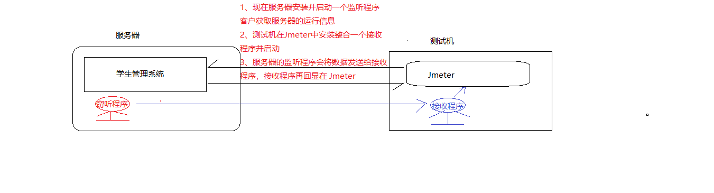
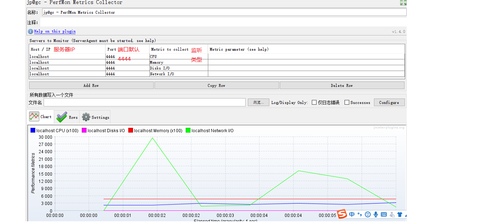

### 1、Jmeter组件:逻辑控制器(重点)

##### A、是什么？

**逻辑控制器**可以控制取样器的实现顺序(分支+循环)的一种组件

类似于计算机语言的流程控制语句，流程控制就是控制代码的执行顺序(分支+循环)

##### B、为什么?

实现多样的业务逻辑

##### C、怎么用？

**C-1、分类**

类别1:分支控制器  ----- if控制器:符合条件就执行

类别2:往复控制器  ----- forEach控制器 + 循环控制器:循环执行

**C-2、实现**

##### 需求1:

​	测试计划中三个 http 请求,分别访问百度、淘宝和京东,不是无差异的都执行，而是有选择性的执行，定义一个用户定义的变量，如果值是 百度，就访问百度，是淘宝就访问淘宝......

**实现：**

​	1)、搭框架(测试计划，线程组，http请求，结果树)

​	        用户定义的变量存储变量值(百度、淘宝或京东)

​	2)、添加一个分支组件，有选择性的执行 http 请求

​	        if 控制器： 编写条件 “${变量名}” == "指定值"

​	3)、查看结果

​		符合条件的执行，不符合条件不执行

##### 需求2:

​	有一组关键字 [hello,python,测试] 要依次取出，并在百度搜索

**实现:**

​	1)、搭框架(测试计划，线程组，http请求，结果树)

​	2)、使用用户定义的变量存储一组数据

​	       规则:同一变量前缀_编号

​	3)、在线程组中添加一个 forEach 控制器，遍历步骤2中的数据，将数据设置进 http 请求

​	        注意索引: 左闭右开的

​	4)、查看结果       

##### 需求3：

​	循环查询所有学院信息10次

**思考:** 线程组属性可以控制循环次数，那么循环控制器有什么用？

​	 循环控制器更灵活，线程组循环是组内所有请求都循环执行，循环控制器可以只是让组内指定的请求循环

### 2、Jmeter组件:QPS

##### A、是什么？

QPS: Query Per Second ---- 每秒查询率，每秒访问服务器资源多少次

20QPS == 每秒访问20次

##### B、为什么?

一个用户以 20QPS 的频率访问服务器，持续10秒，查看服务器的平均响应时间?

一个用户每秒访问20次服务器，持续10秒，查看服务器的平均响应时间?

##### C、怎么用？

使用新的组件实现:常量吞吐定时器 Timer ----> Constant Throughput Timer

实现流程:

1)、搭框架(测试计划，线程组，http请求,聚合报告)

<u>循环次数设置: 频率*持续时间</u> 

2)、添加常量吞吐定时器

<u>将 QPS(每秒查询数) 换算成每分钟查询数</u>

3)、查看聚合报告

throughput 显示的是每秒查询数，参考步骤2设置的值，<u>实际执行一般围绕步骤2的值上下波动</u>

### 3、Jmeter组件综合:作用域(记住)

##### A、是什么？

Jmeter 组件的作用范围(可以影响到哪些组件)

##### B、分类

第一类:以聚合报告为例,只对树形结构上自己的直接父级以及兄弟级以及子级...有效

​	    基本所有组件都属于第一类

第二类:逻辑控制器,只对子级有效

第三类:取样器可以不依赖任何组件存在，可以不对其他组件产生任何影响,

​	     取样器无作用域概念	    

### 4、Jmeter组件综合:执行顺序(记住)

##### A、是什么？

组件: Jmeter的内置功能，每一个功能都是一个组件

元件:元件中存储的都是性质相似的组件(就是对组件的分类管理)

##### B、排序

```
1.各元件之间的执行顺
  1) 配置元件(config elements)  	: 存储了一些程序的全局性数据
  2) 前置处理程序(Per-processors)    ：取样器执行之前执行的组件,可以存储批量执行的数据
  3) 定时器(timers)			    ：在请求执行集合用户
  4) 取样器(Sampler)			    ：访问服务器
  5) 后置处理程序(Post-processors)   :处理响应的结果
  6) 断言(Assertions)			     :断言结果
  7) 监听器(Listeners)   		    :最后执行
```


### 5、Jmeter扩展组件:图形监视器

##### A、是什么？

扩展组件:不是Jmeter 官方提供的，而是自己开发的组件，就是扩展组件

图形监视器:是监视服务器的如,内存、CPU、磁盘、网络等运行状态的组件实现

##### B、为什么?

模拟生产环境下，服务器运行状态的测试

##### C、怎么用？

**C-1、实现思想**

1)、明确应用场景:

学习期间：服务器和测试程序在个人 PC 机，工作时，测试程序可能需要远程访问服务器

我们要测试的是服务器的运行状态

2)、图解流程



**C-2、实现流程**

1)、Jmeter本身不具备该功能，下载安装第三方实现

2)、在服务器端安装窃听程序，在测试机端安装(整合进 Jmeter )接收程序

​        窃听程序: Server_Agent,启动:双击 serverAgent.bat 使用端口号 4444

​	接收程序: 复制Jmeter_Plugins_Starndat 目录下的 jar包,到Jmeter\lib\ext

3)、编写测试脚本启动并执行

​	a)、脚本循环 次数设置为无限

​	b)、添加接收组件: 监听器 ----> jp@gc permon Metrics Collector

​	

​	c)、执行脚本


### 6、Jmeter组件:FTP(了解)

##### A、是什么？

FTP:文件上传和下载

上传:将文件从本地上传到服务器

下载:将服务器资源下载到本地

##### B、为什么?

程序中常见操作 

##### C、怎么用？

C-1、保证服务器程序具备文件上传和下载的功能,安装一个文件上传下载服务器(FTP服务器)

C-2、Jmeter内置了 FTP请求，可以通过此请求实现文件传输测试 

### 7、Jmeter其他组件(不重要)

##### A、控制台：非测试元件之 property diaplay

显示系统共享数据

##### B、控制台：非测试元件之 HTTP mirror server

内置服务器

##### C、TestFragment:测试片段

C-1、作用和函数类似，可以封装某些功能

C-2、执行也和函数类似，不调用不执行 

C-3、调用方式1：模块控制器

​	  调用方式2:  include Controller

### 8、Jmeter项目准备:接口清单提取与整理

##### A、接口清单组成

接口清单组成:

功能模块，每个功能又有三要素: URL + 提交的数据 + 响应的数据

##### B、API文档

Application Programming Interface 应用程序编程接口，此文档中声明了

 程序的功能，以及该功能描述以及访问的资源路径和提交响应的数据

是开发和测试共同遵守的文档说明

##### C、接口清单就是从 API 文档提取整理的

因为 API 文档内容冗余，测试需要从中提取,测试需要的关键信息

##### D、怎么写 API 文档

##### E、怎么提取接口清单?


