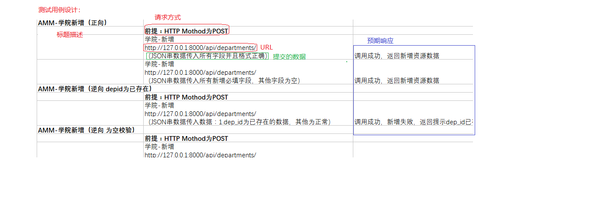

### 1、项目:功能测试(重点)

##### A、是什么?

测试系统中各个接口基本功能是否能够正常运行,提交的数据：正向 + 逆向

##### B、为什么?

要模拟用户的多样性操作，检测程序的响应是否合情合理(符合预期)

##### C、怎么用?

C-1、搭建功能测试框架(CSV 必须)

1)、将数据存入外部文档文件

2)、添加组件读取文档(CSV Data Set Config)

3)、JSON 数据以固定格式引入步骤2读取的数据

C-2、设计测试用例(将用户的操作进行分类)

<u>分类原则:正向 + 逆向(重点)</u>

```
1. 覆盖所有的必选参数(正向)
2. 组合可选参数(n*(n-1)正向_覆盖率问题,考虑人力和时间成本)
3. 参数边界值(逆向_ 比如年龄边界)
4. 如果参数的取值范围是枚举变量，需要覆盖所有枚举值(测试所有可能的数据)    
5. 空数据(逆向_不录入数据)
6. 包含特殊的字符(+-=/....)
7. 越界的数据(逆向_比如长度过长或过短)
8. 错误的数据(逆向_比如错误的手机号、身份证号、重复的id....)    
```

<u>实现模板:</u>



C-3、参数化覆盖测试用例

​	按照测试用例编写测试数据

​	


总结:

测试用例是在设计测试时使用什么类型的数据，就是预设条件以及预期结果 ---- 大纲

参数化覆盖测试用例声明使用什么样的数据(具体的)，按照测试用例实现的   ---- 细节

### 2、项目:自动化测试

##### A、是什么?

由程序生成测试数据且让程序代替人工判断响应结果,就是自动化测试(程序代替人工)

##### B、为什么?

安全、高效、功能强大

##### C、怎么用?

C-1、自动化测试原则

1)、测试程序的主要功能以及一些经常被复用的功能,并非所有

​       自动化测试是对功能测试的补充，应用场景:程序升级时，拓展了一些功能，可能要测试之前的功能是否可用

2)、自动化测试测试数据一般只考虑正向数据

​       自动化测试是对功能测试的补充 +   程序生成多样的测试数据有困难

3)、自动化测试完毕，数据库数据必须恢复成测试之前的状态，优点:重复使用,功能测试不能

4) 、线程组之间不要有**关联**,不要有业务逻辑,优点:可以单独测试某一个功能

C-2、实现流程

1)、搭建框架(抽取 http请求默认值、http信息头管理器、结果树)

2)、setUp 和 tearDown 线程组

3)、数据生成可以借助于  counter 函数，数据格式:自定义前缀_调用计数器函数

4)、使用断言组件让程序代替人工判断响应结果

5)、<u>跨线程组传值</u>

​       思想：setUp 将数据导出到共享空间，tear down 再将数据引入

​       流程: 1)、setUp 要使用  setProperty 导出数据

​		 <u>怎么获取要导出的 id?使用正则表达式提取器</u>

​		 2)、tearDown 使用 property 函数引入数据

6)、普通线程组结合 setUp 和 teardown 使用时的执行顺序:

​       多个普通线程组可能并发执行

7)、直连数据库 

​	a、Jmeter本身不具备数据连接功能，整合第三方实现

​	b、配置数据库连接信息

​	变量名 + 数据库路径 + 第三方的启动入口 + 账号密码

​	c、使用 JDBC Request 操作数据库数据

​	SQL语句有类型: select statement | update statement

​	variable names: 查询的结果赋值给的变量名

​	d、将数据传递给 http 请求 

​	结果的赋值规则:变量名\_# 结果个数 | 变量名_N 第N个结果

​        可以通过 debug sampler 查看底层赋值规则

​	

### 3、项目:性能压力测试

##### A、是什么?

模拟多种场景测试程序的响应时间，出错率....等实现

##### B、为什么?

测试程序的执行效率,执行效率直接关系到用体验

##### C、怎么用?

C-1、原则


C-2、模拟300秒内开启100个虚拟用户，每个用户循环访问服务器资源10次，要求平均响应时间在 30 ms内，且错误率为0

100个用户：线程数指定   循环十次：循环次数     结果查询：使用聚合报告 300秒 Ramp-Up Period

C-3、模拟 100 个用户同时访问服务器资源，要求平均响应时间在30ms内，且错误率为0

Synchnronizing Timer(集合点)

C-4、模拟2个用户都以20QPS的评率访问服务器资源，要求平均响应时间在30ms内，且错误率为0

常量定时器Constant Throughout Timer 20*60

### 4、项目:生成 html 格式测试报告

##### A、是什么?


##### B、为什么?


##### C、怎么用?


